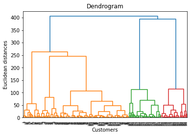
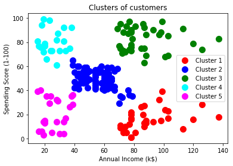
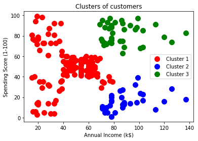

# Hierarchical_Clustering
I cluster the data based on the features of annual income and spending score. Customer behaviour and purchase data are among the aspects that influence a consumer's spending Score. I used the dendrogram to find the level for the threshold of the optimal number of clusters that suits this project. I found the optimal number of clusters by looking at the largest distance when moving the horizontal line vertically. The longest vertical distance that does not cross over each dendrogram was K=3 and K=5. The model output for K=3 and 5 clusters were visualized in 2D as a function of annual income and spending score.

```bash
$ pip install -r requirement.txt
```




